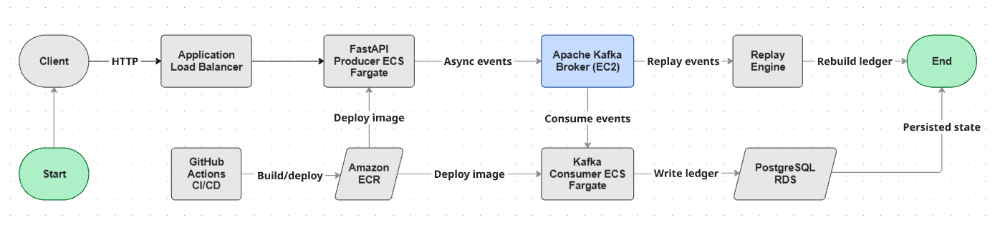
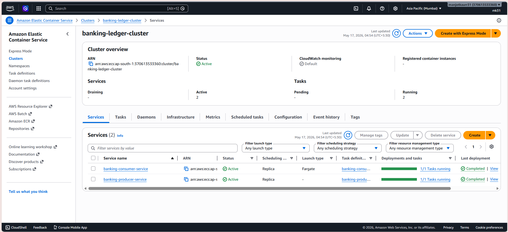
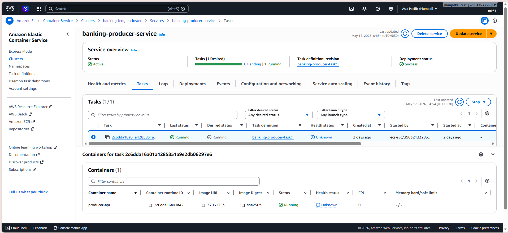
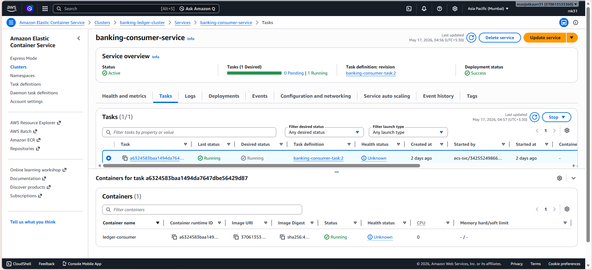
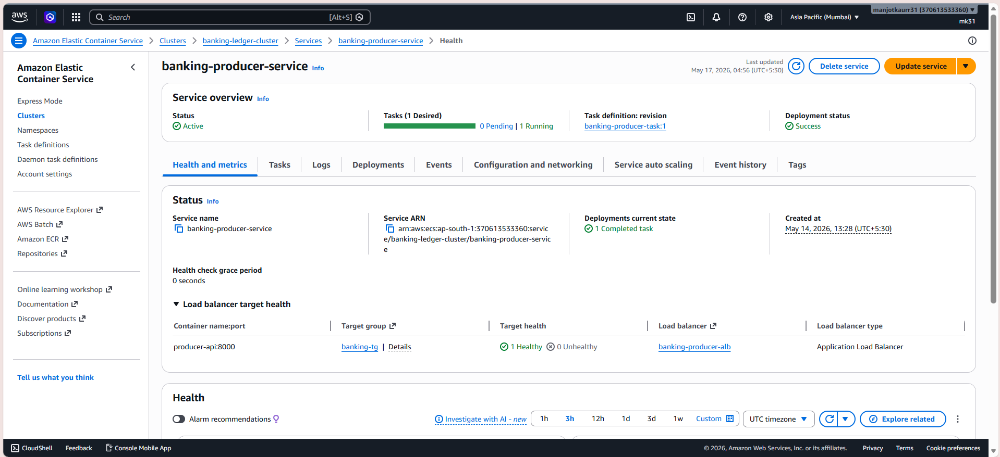
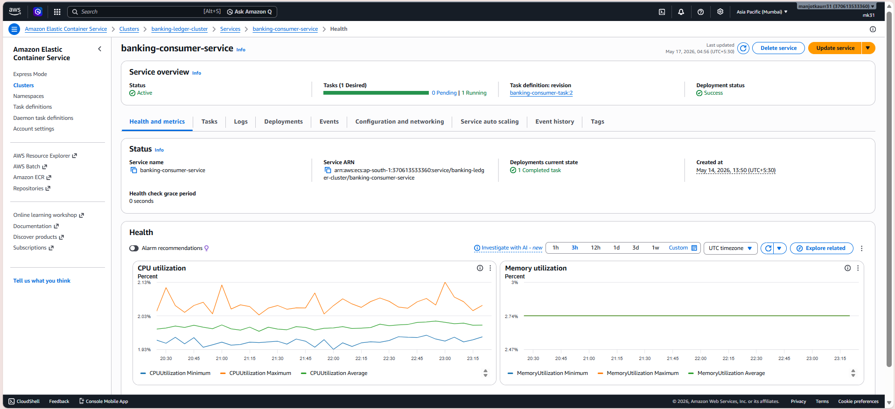
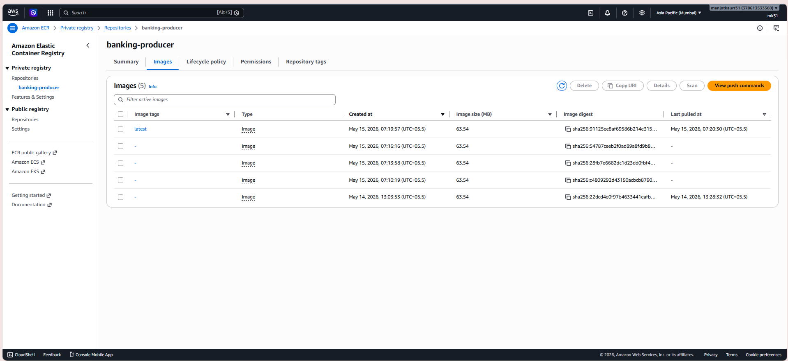
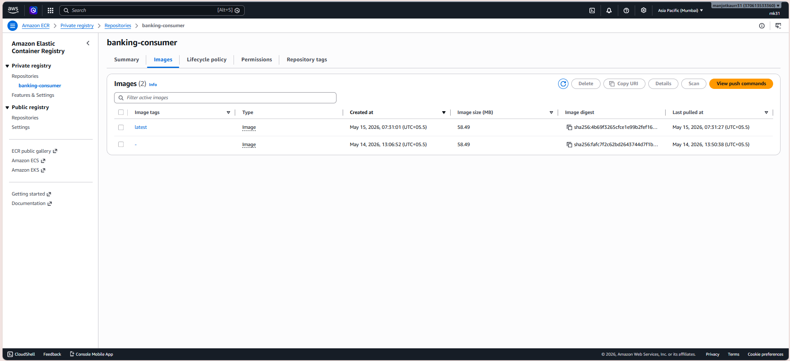
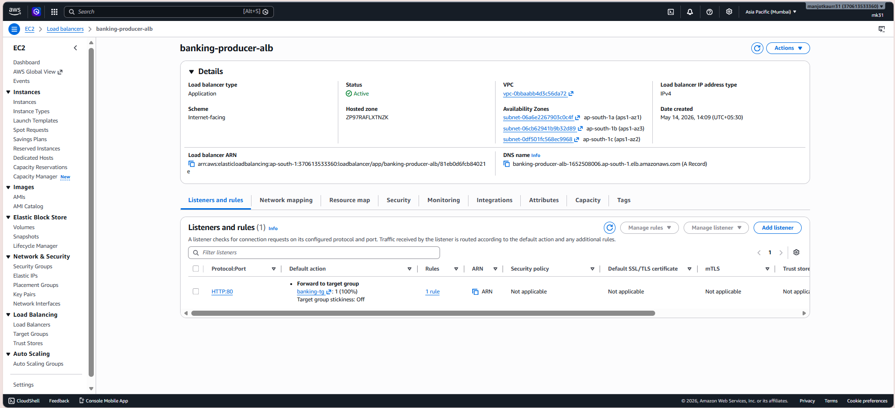
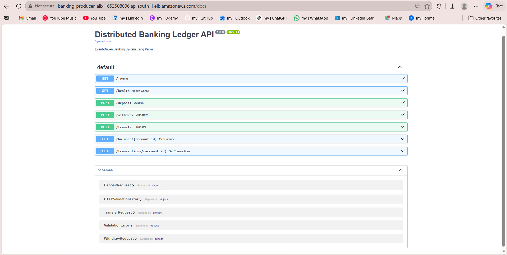

# AWS Kafka Banking Ledger System

A cloud-native event-driven banking backend system built using Kafka, FastAPI, PostgreSQL, Docker, AWS ECS Fargate, Amazon ECR, and GitHub Actions CI/CD. This project simulates banking operations such as deposits and transfers using an append-only event-driven architecture instead of traditional CRUD-based balance updates.

---

# Architecture

```text
Client Request
      │
      ▼
Application Load Balancer
      │
      ▼
FastAPI Producer ECS
      │
      ▼
Kafka EC2 Broker
      │
      ▼
Ledger Consumer ECS
      │
      ▼
PostgreSQL RDS Storage
```

---

# Tech Stack

| Component | Technology |
|---|---|
| Backend API | FastAPI |
| Messaging | Apache Kafka |
| Database | PostgreSQL |
| Containerization | Docker |
| Cloud Platform | AWS |
| Container Registry | Amazon ECR |
| Container Orchestration | ECS Fargate |
| CI/CD | GitHub Actions |
| Architecture Style | Event Sourcing |

---

# Features

- Event-driven transaction processing
- Kafka-producer-consumer architecture
- Immutable transaction append-only logs
- Replayable event history
- Dockerized microservices
- AWS cloud deployment
- GitHub Actions CI/CD pipeline
- Consumer replay mechanism for rebuilding state

---

# Project Structure

```text
banking-ledger-system/
│
├── .github/
│   └── workflows/
│       ├── consumer-deploy.yml
│       └── producer-deploy.yml
│
├── consumer/
│   ├── Dockerfile
│   ├── consumer.py
│   ├── replay.py
│   └── requirements.txt
│
├── kafka/
│   └── docker-compose.yml
│
├── producer/
│   ├── Dockerfile
│   ├── app.py
│   └── requirements.txt
│
└── .gitignore
```

---

# System Workflow

## Producer Service

The FastAPI producer service accepts banking transaction requests and publishes events into Kafka topics.

Example operations:
- Deposit
- Transfer
- Withdrawal

---

## Kafka Broker

Kafka acts as the distributed event streaming platform between producer and consumer services.

Benefits:
- Asynchronous processing
- Fault tolerance
- Replay capability
- Decoupled architecture

---

## Consumer Service

The consumer continuously processes Kafka events and writes immutable transaction records into PostgreSQL.

---

## Replay Mechanism

The `replay.py` service can rebuild ledger state from Kafka event history.

Replay workflow:
1. Clear database state
2. Reset offsets
3. Replay historical Kafka events
4. Reconstruct balances

This demonstrates event sourcing concepts used in distributed financial systems.

---

# HTTP Request
## Deposit Request

```http
POST /deposit
```

```json
{
  "account_id": "A101",
  "amount": 5000
}
```

---

## Transfer Request

```http
POST /transfer
```

```json
{
  "from_account": "A101",
  "to_account": "A102",
  "amount": 1200
}
```

---

# Docker Setup

## Start Kafka

```bash
ssh -i key.pem ubuntu@EC2_PUBLIC_IP
cd ~/kafka-server
docker compose up -d
```

---

## Build Producer

```bash
ssh -i key.pem ubuntu@EC2_PUBLIC_IP
cd ~/banking-api
docker build -t banking-producer .
```

---

## Build Consumer

```bash
ssh -i key.pem ubuntu@EC2_PUBLIC_IP
cd ~/consumer-ledger
docker build -t banking-consumer .
```

---

# AWS Deployment

## Services Used

- ECS Fargate (Producer & Consumer)
- ALB (banking-roducer-service)
- EC2 Instance (Kafka Broker)
- Amazon ECR
- PostgreSQL RDS

---

# CI/CD Pipeline

GitHub Actions automates:

1. Docker image build
2. Push to Amazon ECR
3. ECS deployment update
4. Automated Fargate rollout

---

# Architecture Diagram

```html
<p align="center">
  
</p>
```

---

# ECS Deployment Screenshots

## ECS Cluster

```html
<p align="center">
  
</p>
```

---

## Running ECS Services

```html
<p align="center">
  
</p>
```

```html
<p align="center">
  
</p>
```

---

# ECR Tasks

```html
<p align="center">
  
</p>
```

```html
<p align="center">
  
</p>
```

---

# ECR Repositories

```html
<p align="center">
  
</p>
```

```html
<p align="center">
  
</p>
```

---

# Application Load Balancer

```html
<p align="center">
  
</p>
```

---

# Producer FastAPI
## Swagger UI

```html
<p align="center">
  
</p>
```

---

# Why This Project Matters

This project demonstrates:

- Distributed systems fundamentals
- Event-sourcing backend architecture
- Kafka-based asynchronous communication
- Replayable transaction processing
- Cloud-native deployment
- CI/CD automation
- Containerized services

Compared to traditional CRUD applications, this architecture is significantly closer to real-world backend engineering systems.

---

# Future Improvements

Potential future enhancements:

- Kafka Streams integration
- Dead-letter queues
- Exactly-once semantics
- Redis caching
- Terraform IaC
- Prometheus + Grafana monitoring
- Multi-broker Kafka cluster
- Authentication and authorization
- Saga orchestration

---

# Resume Bullet

Built and deployed a cloud-native event-driven banking ledger system using FastAPI, Kafka, PostgreSQL, Docker, AWS ECS Fargate, Amazon ECR, and GitHub Actions CI/CD with replayable transaction processing and immutable event storage.

---
